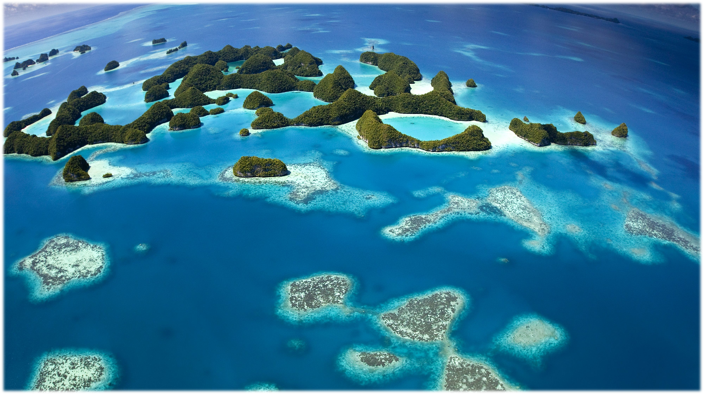
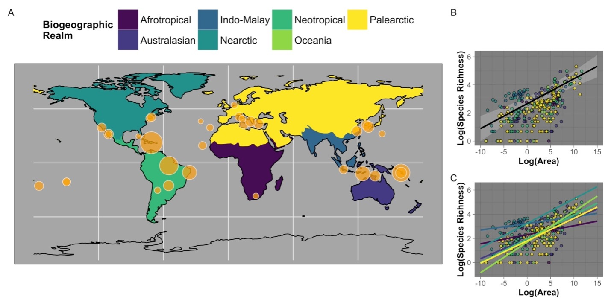

```{r setup, include=FALSE}
knitr::opts_chunk$set(echo = TRUE,cache = TRUE)
```
```{r, echo=FALSE, fig.cap="", out.width = '100%', fig.align='center'}

```

# Island Biogeography Research
The Theory of Island Biogeography, a foundational framework for ecology and biogeography, was motivated in part by consideration of the species–area relationship (SAR). A SAR describes the tendency for species richness to increase with increasing area and is one of the few patterns in ecology that has been called a general “law”. SARs have been instrumental in the field of conservation biogeography, including in the design of nature reserves, extinction forecasting, and gauging the effects of habitat fragmentation. I find the SAR to be an extremely important tool for further understanding how biodiversity scales across area.

While my research focuses on ants, the implications and suggestions from this research extend well beyond a single taxon. This is especially important at a time where human impacts on  biodiversity patterns from local to global scales show conflicting trends in the scientific literature. The remaining pockets of biodiversity in minimally disturbed systems are rapidly disappearing. Therefore, now more than ever, there is a need to further understand the scaling properties of biodiversity. Research conducted on taxonomically well-resolved and globally distributed organisms, like ants, can provide this much needed and time-sensitive information.

```{r, echo=FALSE, fig.cap="Global distribution of studies collected for ant species-area data", out.width = '75%', fig.align='center'}

```

Previous studies show large variation in the SAR across taxa, collectively indicating the necessity of a taxon-focused approach to accurately evaluate biodiversity scaling patterns. Ants are ideal for this given their diversity, global distribution, and role in ecosystem functioning. Using data from insular ant communities, I seek several major objectives:

1.Quantify differences between insular and mainland SARs 

2.Investigat how abiotic variables influence the slope (measured using the z-value of the power model) of the SAR 

3.Seek a general SAR slope for ants

4.Review the SAR literature for ant faunas, world-wide, to identify specific areas for improvement.

