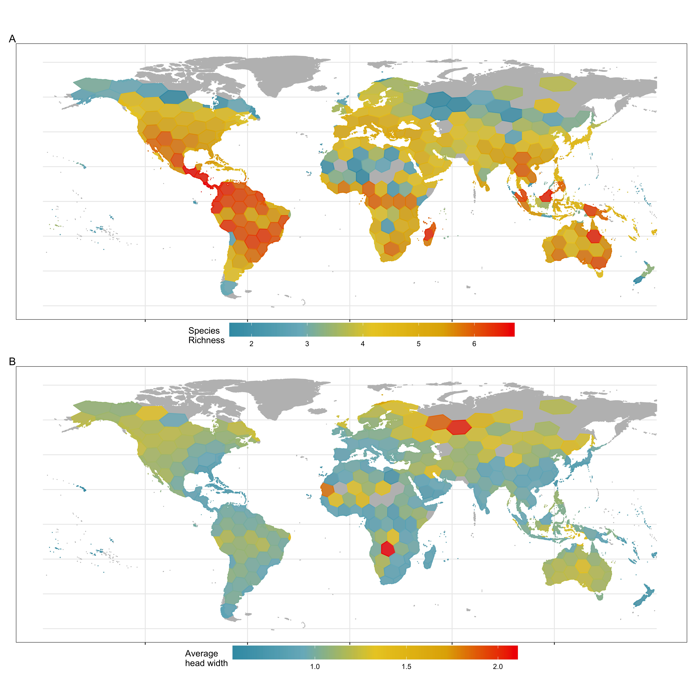

```{r setup, include=FALSE}
knitr::opts_chunk$set(echo = TRUE)
```
```{r, echo=FALSE, fig.cap="", out.width = '45%', fig.align='center'}

```

# Macroecology

I am fascinated by large-scale patterns and processes that structure biodiversity. As such macroecological approaches work hand-in-hand with my research questions and objectives. My current research involves two major objectives:

1. The first aims to evaluate the drivers of biodiversity through the potential interactions of intrinsic and extrinsic variables, more specifically, how the **environment** and the **function** of the species that comprise an **assemblage** influence their biodiversity.

2. The second objective is to assess biodiversity in a comparative manner that involves multiple dimensions of how we measure biodiversity (traits, functional groupings, evolutionary relatedness, species richness etc.)

Stay tuned for more updates


