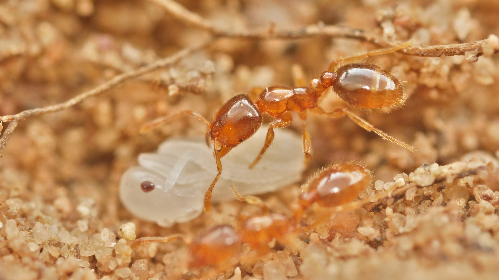

```{r setup, include=FALSE}
knitr::opts_chunk$set(echo = TRUE)
```
```{r, echo=FALSE, fig.cap="Thief ants of the genus Solenopsis (Photo: Philipp Hönle)", out.width = '75%', fig.align='center'}

```

# Community Ecology
While empirical studies done at large spatial scales are informative, I'm a firm believer that such studies are only as good as the local-scale studies that help support them. As such, the observations and experiments that are done at the local-scale are extremely important. To better understand ants at the local scale, I spent roughly 3 years conducting field experiments and surveys throughout my masters degree. 

The focus of that research was on the genus *Solenopsis*, and more specifically the thief ant group. Thief ants are tiny ants (~1-2mm long) that steal the brood or eggs of other ants for consumption. They are often subterranean, living almost the entirety of their lives belowground. Due to their mostly subterranean natural history, not much is known of their biology yet they are one the most abundant ants in the world. I assessed their diversity and distributions in high pine habitats of Florida and also ran experimental manipulations to reduce their abundance in the field in order to assess their potential impact as subterranean predators.

Through my research I identified that [strong soil environmental variables can heavily influence thief ant diversity](https://myrmecologicalnews.org/cms/index.php?option=com_content&view=category&id=1518&Itemid=421) and also found that [thief ants have an extremely oversized effect on the surrounding ant community](https://esajournals.onlinelibrary.wiley.com/doi/abs/10.1002/ecy.3084) as over a year of thief ant suprresion in the field let to exploding numbers in populations of other co-occuring ants. 


# Non-native ant research
I have also delved into understanding the impacts of non-native ants on native ant communities. Non-native 
